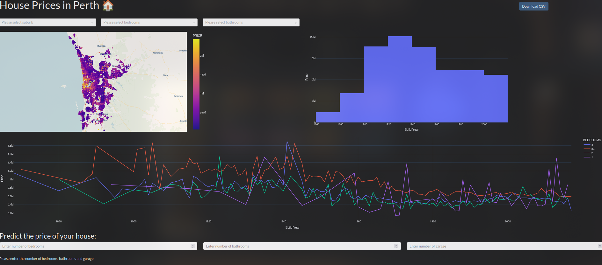

# House Prices in Perth Web App

## Overview

This is a Python-based web application built using [Plotly Dash](https://dash.plotly.com/). It visualizes house prices in Perth using an interactive dashboard and includes a simple prediction tool for estimating house prices based on selected parameters.

This is the first web application I have developed using Python, and it serves as a great learning experience for working with data visualization and web development.

## Features

- **Interactive Map**: Displays house prices across Perth using a heatmap.
- **Filters**: Allows users to filter by suburb, number of bedrooms, and bathrooms.
- **Price Trends**: Visualizes price trends over time.
- **Prediction Tool**: A simple estimator to predict house prices based on user input.
- **CSV Download**: Option to download filtered data for further analysis.

## Technologies Used

- **Python**
- **Plotly Dash**
- **Pandas** (for data manipulation)
- **Dash Components** (for interactivity)

## Screenshot

Below is a screenshot of the web application:



## How to Run

1. Clone the repository:
   ```bash
   git clone https://github.com/Ratludu/House_Price_DB
   cd House_Price_DB
   ```
2. Install dependencies:
   ```bash
   pip install -r requirements.txt
   ```
3. Run the app:
   ```bash
   python app.py
   ```
4. Open your browser and navigate to:
   ```
   http://127.0.0.1:8050/
   ```

## Future Improvements

- Enhancing the prediction model with machine learning.
- Adding more filtering options.
- Improving UI/UX with better styling.

## Author

This project was developed as my first experience with Python web apps using Plotly Dash.

---

Feel free to contribute or provide feedback!

**GitHub Repository**: [House\_Price\_DB](https://github.com/Ratludu/House_Price_DB)


